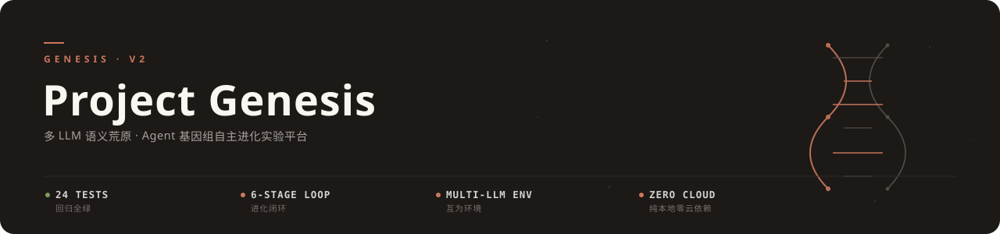
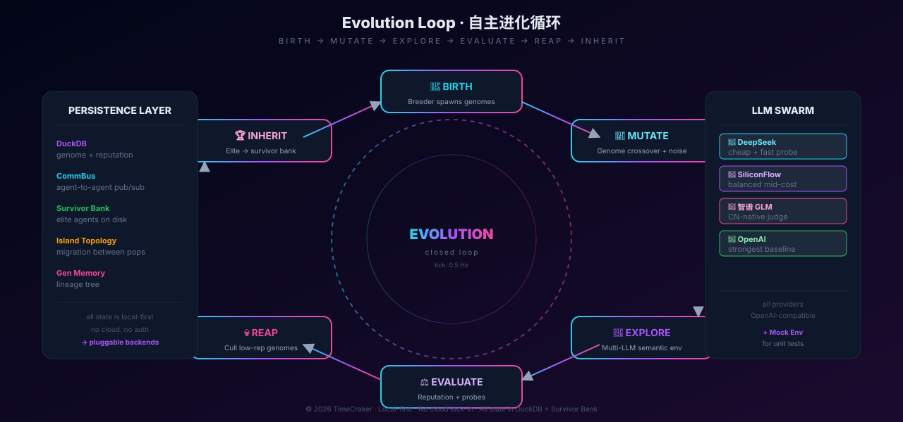

<div align="center">



# Project Genesis v2

**多 LLM 语义荒原 · Agent 基因组自主进化实验平台**

一群 LLM Agent 组成的种群，其基因组在闭环中变异、竞争、继承——纯本地运行，零云依赖。

[](https://github.com/TimeCraker/genesis-v2/actions/workflows/ci.yml)
[](tests/)
[](https://www.python.org)

</div>

---

## 核心理念

**用多 LLM 互相打分当环境，让 Agent 基因组在语义荒原里自主演化。**

它**不是** ChatGPT 套壳、不是单一 Agent 框架、不需要 GPU 或云服务。它是：

- 一个**闭环进化模拟器**——六个阶段，每 tick 走一轮
- **多 LLM 互为环境**：DeepSeek 提问 · 智谱评分 · SiliconFlow 探索，一行配置互换
- **可插拔持久化**：DuckDB + CommBus + Survivor Bank + Island Topology
- **可观测**：Streamlit Dashboard + 24 个测试守住回归

## 进化循环

<div align="center">

</div>

| 阶段 | 做什么 | 模块 |
|---|---|---|
| **BIRTH** | 育种者生成新基因组 | `Breeder` |
| **MUTATE** | 基因组交叉 + 噪声 | `Genome.crossover / mutate` |
| **EXPLORE** | 在多 LLM 语义环境试错 | `MultiLLMEnv` |
| **EVALUATE** | 同行评分 + 自适应探针 | `Reputation / Probes` |
| **REAP** | 淘汰低声誉基因组 | `Reaper` |
| **INHERIT** | 精英进入 Survivor Bank | `SurvivorBank` |

## 快速开始

```bash
git clone https://github.com/TimeCraker/genesis-v2.git && cd genesis-v2/genesis_v2
uv sync --extra dev

uv run pytest -v                                    # 24 个测试应全绿
uv run streamlit run scripts/dashboard.py           # Dashboard @ localhost:8501
uv run python -m genesis_v2.cli run --pop 16 --ticks 100   # 跑一次小规模实验
```

## 核心概念

| 概念 | 一句话 |
|---|---|
| **Genome** | Agent 的「基因」——可变异、可交叉的 prompt 模板 + 工具调用偏好 |
| **Reputation** | 同行 + 探针共同打分的「生存能力」指标 |
| **Island** | 多子种群 + migration 交换基因，避免局部最优 |
| **CommBus** | Agent 间发布订阅消息总线（去中心化协作） |
| **Survivor Bank** | 高分基因组持久化池，新生代 birth 优先采样 |
| **Probe** | 自适应「考卷」，让 Agent 刷不了题 |
| **Self-Mod** | Agent 修改自身 prompt 的能力（受 reputation gate） |

## 技术栈

| 领域 | 选型 | 理由 |
|---|---|---|
| 语言 | Python 3.12+ | dataclass + asyncio + match |
| 存储 | DuckDB | 列式 · 单文件 · 零部署 |
| LLM | OpenAI 兼容协议 | 一行切 DeepSeek / 智谱 / SiliconFlow |
| Dashboard | Streamlit + Plotly | 写脚本即出图 |
| 演化 | 自研 + networkx | 图结构表达 island migration |
| 测试 | pytest + hypothesis | 单测 + property-based |
| 工具链 | uv · ruff · GitHub Actions | 快，且 CI 已配 |

## 路线图

- [x] 六阶段进化闭环
- [x] DuckDB 持久化
- [x] Island topology + migration
- [x] Multi-LLM 语义环境
- [x] Self-mod + reputation gate
- [x] Streamlit dashboard · 24 测试 · CI
- [ ] LLM-as-Judge（探针评分完全交给 LLM）
- [ ] 跨实验 lineage 可视化
- [ ] Agent 工具调用 benchmark
- [ ] 多目标优化（能耗 vs 性能 vs 安全）

## License

详见 [LICENSE](LICENSE)。

<div align="center">
<sub>智能来自选择压力 / Intelligence from selection pressure</sub>
</div>
